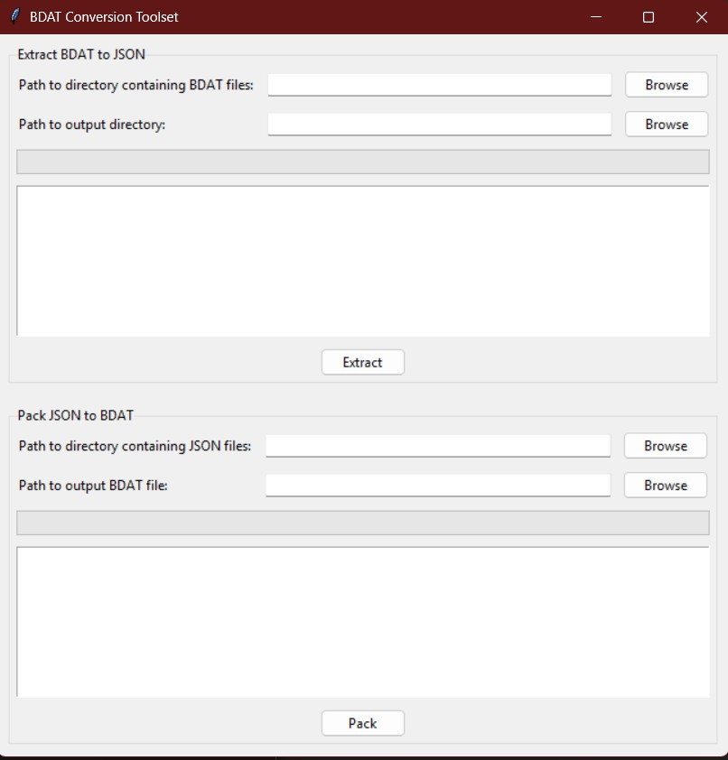

<div align="center">
# 🎮 BDAT GUI Tool
   
*A graphical interface for Xenoblade's BDAT file operations*


[](https://www.python.org/)
[](https://github.com/roccodev/bdat-rs)

</div>

## ✨ Overview

BDAT GUI Tool provides a user-friendly interface for handling Xenoblade's BDAT files, enabling batch extraction and packing operations. This tool serves as a graphical wrapper for the [bdat-rs toolset](https://github.com/roccodev/bdat-rs/blob/master/toolset/README.md).

💝 **Special Thanks**  
 Huge appreciation to [RoccoDev](https://github.com/roccodev) for creating the bdat-rs toolset. This GUI tool stands on the shoulders of their exceptional work with BDAT file handling.



## 📋 Requirements

### Essential Components
- 🖥️ Windows operating system
- 🔧 `bdat-toolset.exe` (placed in the same directory)

### For Source Code Users
- 🐍 Python 3.x
- 📦 tkinter (included with Python)

## 🚀 Installation

### Pre-built Release
> 🚧 **Coming Soon!**  
> A compiled version will be available in future releases. Stay tuned!

For now, please follow the "From Source" instructions below.

### From Source
1. 📋 Clone the repository
2. ⬇️ Get `bdat-toolset.exe` from [bdat-rs releases](https://github.com/roccodev/bdat-rs/releases)
3. 📁 Place `bdat-toolset.exe` in the project directory
4. 📦 Install dependencies:
   ```bash
   pip install tkinter
   ```
   > Note: tkinter usually comes with Python installation. If you're missing it, you may need to reinstall Python and check the "tcl/tk and IDLE" option during installation.
5. ▶️ Run `python bdat_gui.py`

## 🎯 Features

- 🖼️ Intuitive graphical interface
- 📦 Batch BDAT extraction to JSON
- 🔄 Batch JSON to BDAT packing
- 📊 Progress tracking
- 📝 Detailed operation logging
- 🗂️ Easy file/directory selection

## 📖 Usage Guide

### 🔍 Extracting BDAT Files

1. Navigate to "Extract BDAT to JSON" section
2. Select input directory (containing .bdat files)
3. Choose output directory
4. Click "Extract" and monitor progress

### 💾 Packing JSON Files

1. Navigate to "Pack JSON to BDAT" section
2. Select input directory (containing JSON files)
3. Choose output directory
4. Click "Pack" and monitor progress

## 📝 Important Notes

- Each BDAT file gets its own output directory during extraction
- JSON files must match the extraction format for successful packing
- Operations run in separate threads for smooth GUI experience
- Progress and logs are displayed in real-time

## ⚠️ Troubleshooting

### Common Issues

| Issue | Solution |
|-------|----------|
| 🚫 "No BDAT directory selected" | Select a valid directory with BDAT files |
| 📁 "No output directory selected" | Choose an output location |
| ❌ "bdat-toolset.exe not found" | Place `bdat-toolset.exe` in the correct directory |
| ⏳ Operation appears frozen | Check log window for status |

## 👥 Credits

<div align="center">

**Core Toolset**  
[RoccoDev](https://github.com/roccodev) - Creator of [bdat-rs](https://github.com/roccodev/bdat-rs)

---

*Made with ❤️ for the Xenoblade community*

</div>
